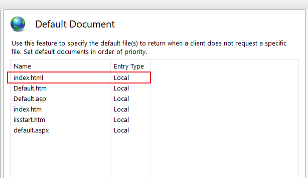

# Exercise 1  
## **Description**  
Publish a simple website on IIS by placing the site's folder in the `wwwroot` directory within IIS.  

## **Solution**

### Step 1: Create the Website Content
- Create a folder on your computer where you will store your website files
- Inside this folder, create two HTML files:
  - `index.html` (Home Page)
  - `about.html` (About Page)

   **Example content for `index.html`:**
   ```html
   <!DOCTYPE html>
   <html lang="en">
   <head>
       <meta charset="UTF-8">
       <meta name="viewport" content="width=device-width, initial-scale=1.0">
       <title>Home Page</title>
   </head>
   <body>
       <h1>Welcome to My Website</h1>
       <p>This is the home page.</p>
       <a href="about.html">About Us</a>
   </body>
   </html>
   ```

   **Example content for `about.html`:**
   ```html
   <!DOCTYPE html>
   <html lang="en">
   <head>
       <meta charset="UTF-8">
       <meta name="viewport" content="width=device-width, initial-scale=1.0">
       <title>About Page</title>
   </head>
   <body>
       <h1>About Us</h1>
       <p>This is the about page of my simple website.</p>
       <a href="index.html">Home</a>
   </body>
   </html>
   ```


### Step 2: Add a New Website
   - In the IIS Manager, right-click on the `Sites` node in the Connections pane and select **Add Website**.
   - In the **Add Website** window, configure the following settings:
     - **Site Name:** `SimpleSite`
     - **Physical Path:** Browse to the folder where your HTML files are located (`C:\inetpub\wwwroot\SimpeSite`).
     - **Binding:**
       - **Type:** `http`
       - **IP Address:** `All Unassigned`
       - **Port:** `5555` 
       - **Host Name:** Leave blank for now.
     - Click **OK** to create the website.
  
### Step 3: Set the Default Document
- In the IIS Manager, select your site (`SimpleSite`) under the `Sites` node.
- Double-click on the `Default Document` icon.
- Ensure `index.html` is listed. If not, click `Add` and type `index.html`.


<div align="Center">

  
  
</div>


### Step 4: Test the Website Locally  


You can do on of the following options:

1. **Start the Website:**
   - Right-click on your site (`SimpleSite`) in the IIS Manager and select **Manage Website** > **Start**.

2. **Browse the Website:**
   - Open your web browser and navigate to `http://localhost`.
   - You should see the home page (`index.html`).
   - You can also access the about page by navigating to `http://localhost/about.html`.
  

<div align="Center">

  
  
</div>
  
  
### Step 5: Configure Firewall (If Needed)
- If you plan to access the website from another machine, ensure that your firewall allows traffic on port 5555 (HTTP). 
- To do this:
  - Open **Windows Firewall with Advanced Security**.
  - Create a new inbound rule to allow traffic on port 5555.
  
### Step 6: Access the Website from Other Devices (Optional)
1. **Find the IP Address of the Hosting Machine:**
   - Open a command prompt and type `ipconfig`.
   - Note the IPv4 Address (e.g., `192.168.1.100`).

2. **Access the Website from Another Device:**
   - On another device connected to the same network, open a web browser and navigate to `http://192.168.1.100:5555`.
   - You should see your website.