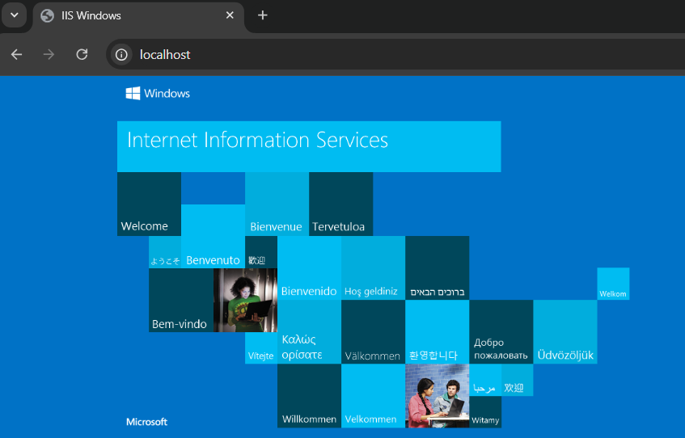

# IIS Installation Steps

## 1. **Open the Control Panel**
## 2. **Search for `Turn windows features on or off` as the following then click on it**

   
  

## 3. **Turn On IIS**
   - In the Windows Features window, scroll down and find **"Internet Information Services"**.
   - Check the box next to "Internet Information Services".
   - You can expand it to select specific components like:
     - **Web Management Tools**
     - **World Wide Web Services**
     - **FTP Server** (if needed)
   - If you’re unsure, you can leave the default options checked.

   
  

## 3. **Checking That IIS Has Been Installed Correctly**

   

   

## **For More detail you check the following link**

[Install IIS and ASP.NET Modules](https://learn.microsoft.com/en-us/iis/application-frameworks/scenario-build-an-aspnet-website-on-iis/configuring-step-1-install-iis-and-asp-net-modules)

