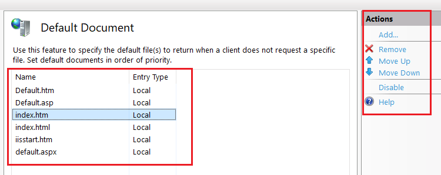

<h2 dir="rtl" align="center">
بسم الله الرحمن الرحيم
</h2>

# IIS Revision

This revision is designed to provide a concise overview of **IIS**, including both basic and some advanced concepts. It is intended especially for web developers and anyone interested in **IIS**. Let's start.

Before learning **What is IIS**, we need to understand **What is a Web Server**.

## What is the Web Server?
A web server is a specialized software that handles HTTP requests from clients (usually web browsers) and serves them web pages or resources.   
It interprets the requests and fetches the appropriate content, delivering it back to the client.

**Examples:**:
- Microsoft’s IIS
- Nginx
- Apache


## What is Internet Information Services (IIS)?

**IIS** is a **web server software** developed by Microsoft to host and serve websites and applications on the Windows operating system. It supports multiple protocols such as HTTP, HTTPS, FTP, and more. **IIS** is well-suited for hosting ASP.NET and .NET Core applications, and it also supports other web technologies through additional configurations.


## Sites
In IIS, a "site" is a top-level entity that can contain one or more web applications and virtual directories.   
Each site is distinguished by **one or more Unique bindings**. 

### Binding
**Binding** involves two key attributes that are crucial for server-client communication:

1. **Binding Protocol**: Defines the protocol used for communication between the server and the client (e.g., HTTP or HTTPS).

2. **Binding Information**: Specifies the details required to access the site, it includes:
     - **IP Address:** The specific IP address the site listens on (e.g., `192.168.1.1`).
     - **Port Number:** The network port the site uses (e.g., port `80` for HTTP or `443` for HTTPS).
     - **Host Header (Domain Name) :** The domain name associated with the site (e.g., `www.example.com`), While the Host Header is technically `optional`, it is often necessary when multiple sites are hosted on the same IP address and port, a scenario known as `host-header-based` or `name-based` virtual hosting.

 ### Default Ports
   - Port 80 is the default port for **HTTP**. So connecting  to **http://domain** would send you to **http://domain:80** (by default).
   - Port 443 is the default port for **HTTPS**. Similarly, connecting  to  **https://domain**, would send you to **https://domain:443** (by default).
   - For any non-default ports, you need to explicitly specify the port like **url:port** to connect to. also you would need to make sure that the new port is open, forwarded and can receive connections.
  

 ### Consideration on Selecting Site Ports
   1. **Avoid Well-Known Ports**:
      - Ports `0-1023` are well-known and often reserved for system or well-established services (e.g., SSH on port 22, FTP on port 21). Unless your site is specifically providing one of these services, avoid these ports.
  
   2. **Avoid Commonly Used Ports**:
      - Ports `1024-49151` are registered ports, and many are commonly used by applications (e.g., MySQL uses port 3306). To avoid conflicts, choose a port that is less likely to be used by other applications.
  
   3. **Use Dynamic/Private Ports**:
      - Ports `49152-65535` are dynamic or private ports. These are less likely to conflict with other services, making them a good choice for internal or custom web applications.
  
   4. **Firewall and Security Considerations**:
      - Ensure that the chosen port is open in your firewall and not blocked by security policies.
  
One thing to note is that while these guidelines are generally good practice, the actual implementation can vary depending on the specific environment, operating system, and network configuration. For example, some systems might use slightly different port ranges for dynamic allocation.
Also, it's worth mentioning that for public-facing web applications, it's common to use standard HTTP (80) or HTTPS (443) ports.

## Virtual Directories
Virtual directories are used within IIS to create a logical directory structure under a site. These directories can point to different physical paths on the server or even different servers.

**Example**   
If you create a virtual directory named `app1` under `www.example.com`, requests to `www.example.com/app1` will be routed to the corresponding application.


## Applications within a Site
- Applications is a collection of files and directories that works as a single web application.
- it has its own application pool, configuration settings, and can run independently of other applications.
- Each application within a site is associated with a unique **application path**, which is a virtual directory under the site's root URL for example:
   **Application Path:** For example, if a site’s URL is `www.example.com`, applications can be accessed via paths like:
  - `www.example.com/app1`
  - `www.example.com/app2`
  
### **Applications vs  Virtual Directories**
An application in IIS is a virtual directory that has been configured to run as an independent web application.  

In summary, in IIS:
- Every application is a virtual directory.
- However, not every virtual directory is configured as an application.

## Application Pool
- Application Pool is a mechanism that allows you to isolate your web applications for better security, reliability, and performance.  
- Each application in IIS can be assigned to a separate **Application Pool**. This provides process **isolation**, meaning each application runs in its own worker process, which means that if one application crashes, it won't affect the others running in different application pools.

### Application Pool Identity

- The identity of an application pool is the user account under which its worker processes run. This account determines what permissions the application pool has on the server, such as access to files, directories, and other system resources.
- Default identity is typically `ApplicationPoolIdentity`, a built-in, virtual user account that IIS automatically creates and manages for each application pool
- Custom identities can be used if the application needs specific permissions.


### Benefits of Application Pools
  - **Security:** If one application crashes, it doesn’t affect others.
  - **Resource Management:** Each application can have different settings for memory, CPU, and other resources.
## IUSR and IIS_IUSRS
**IUSR** and **IIS_IUSRS** are specific accounts and groups used by IIS (Internet Information Services) to manage permissions and security contexts.

### 1. IUSR Account
   - The IUSR account is a built-in user account used by IIS to handle anonymous access to web applications.
   - When anonymous authentication is enabled on a website, requests without credentials are processed using the IUSR account. This means the web application will run with the permissions assigned to this account.
   - The IUSR account is designed with low privileges to minimize security risks, restricting the actions anonymous users can perform.

### 2. IIS_IUSRS Group
   - IIS_IUSRS is a built-in group that includes all accounts used by IIS for running application pools and other related tasks.
   - When you use the default ApplicationPoolIdentity for your application pools, those application pools automatically become members of the IIS_IUSRS group.
   - This group grants the necessary permissions for application pools to access specific resources (like file system paths, event logs, etc.) on the server, simplifying permission management across multiple application pools.

### Summary
- **IUSR** is an account used for anonymous authentication, enabling anonymous access to web applications.
- **IIS_IUSRS** is a group that encompasses all IIS-related accounts, particularly those used by application pools, to manage access rights and permissions efficiently.

## wwwroot Folder
The **wwwroot** folder is the default directory in IIS where your website's files (HTML, CSS, JavaScript, images, etc.) are stored. It serves as the root directory for your website's content:

**Location**: By default, it's located at `C:\inetpub\wwwroot`.  
**Purpose:** The folder is accessible by the web server and defines the document root for your IIS-hosted website. All files and subdirectories within "wwwroot" are publicly accessible by default unless restricted by permissions or settings.

#### Using another folder  
If you want to use another folder you will need Ensure the IIS user account has appropriate permissions to access the folder. You might need to give the `IIS_IUSERS` group Read and Execute permissions as the following :
   - Right-click on the `D:\MyWebsite` folder and select **Properties**.
   - Go to the **Security** tab and click on **Edit** to change permissions.
   - Click **Add** and type `IIS_IUSRS` into the object name box, then click **Check Names** and **OK**.
   - Select `IIS_IUSRS` from the list and check the box for **Read & execute** and **Read** permissions.
   - Click **Apply** and **OK**.


## URL Rewrite

**URL Rewrite** module in IIS allows you to modify incoming request URLs based on specific rules, potentially routing them to different applications.

**Example**
[URL Rewrite Example](./Examples/URL-Rewrite-Example.md)

## Default Document
 
In IIS (Internet Information Services), the **Default Document** is the file that the server automatically loads when someone visits a website without specifying a specific page. For example, if someone goes to `www.example.com`, the server will look for a default document, like `index.html` or `default.aspx`, and display that page.
<div align="Center">

  
  
</div>


### Here’s how it works

- **Order of Documents**: IIS checks a list of default documents in a specific order. If it finds one of these files in the website’s root folder, it serves that file.
- **Customizable**: You can change the order or add/remove files in this list. For example, if you want `home.html` to be the first page loaded, you can add it to the list and move it to the top.

So, the **Default Document** setting ensures that visitors see a webpage even if they don’t specify a file name in the URL.


## How IIS Handel Requests to Hosted Applications

To understand we need to first to Know the following
- What are Internal IP and External IP
- What is Domain Name System (DNS)


### What are Internal IP and External IP

#### **Internal IP**   
Also known as a private IP, this address is used within a private network (such as a home or business network). These addresses are not directly accessible from the internet.

Devices within this network communicate using internal IP addresses but cannot access the internet directly.

To enable devices with **private IP** addresses to access the internet, **Network Address Translation (NAT)** is used. NAT translates the private IP addresses into a **public IP** address for use on the internet. When an external server sends a response, NAT translates it back to the appropriate **private IP** address within the network.

To know your **Internal IP** use the following command
  ```cmd
  ipconfig
  ```
  Then look for the section labeled **Ethernet adapter** or **Wireless LAN adapter** (depending on whether you're connected via Ethernet or Wi-Fi). Your internal IP address will be listed under "IPv4 Address".


#### **External IP**  
Also known as a **public IP**, this address is assigned by an **Internet Service Provider (ISP)** and is accessible from anywhere on the internet. It allows devices on the internet to communicate with devices on the private network.

To find your external (public) IP address, you can use any of the following methods:

 1. **Using a Web Browser:**
   - Open your web browser and visit any of these websites:
     - [WhatIsMyIP.com](https://www.whatismyip.com/)
     - [IPinfo.io](https://ipinfo.io/)
   - Your external IP address will be displayed at the top of the page.

 2. **Using Command Line Tools:**

   - **Windows PowerShell:**
     - Open **PowerShell** and type the following command:
       ```powershell
       (Invoke-WebRequest -Uri "https://api.ipify.org").Content
       ```

### What is Domain Name System (DNS)
DNS is like the phonebook of the internet. It translates human-friendly domain names (like `www.example.com`) into IP addresses (like `192.168.1.1`) that computers use to identify each other on the network.

#### How DNS Works 
- When a user enters a domain name in their browser, a DNS server resolves it to the appropriate IP address, which then allows the client to connect to the web server hosting that domain.

- DNS usually resolves to an **external IP** address for web traffic, **internal IP** addresses come into play when routing traffic within a private network.  

### How IIS Handel Requests to Hosted Applications

#### **With Domain:**

1. **User Enters URL:** The user enters a URL with a domain name into their web browser (e.g., `http://www.example.com`).
2. **DNS Resolution:** The browser sends a request to the DNS to resolve the domain name to an IP address.
3. **Request to Web Server:** Once the domain name is resolved to an IP address, the browser sends the request to the corresponding web server (e.g., IIS) using the obtained IP address.
4. **IIS Request Routing:** IIS receives the request and uses the host header (the domain name) to determine which hosted application should handle the request.
5. **Server Response:** The web server processes the request, possibly interacting with backend services, databases, etc., and then sends the appropriate response back to the client.


#### **Without Domain:**

1. **User Enters IP Address:** The user enters an IP address directly into their web browser (e.g., `http://192.168.1.1`).
2. **Request to Web Server:** The browser sends the request directly to the web server at the specified IP address.
3. **IIS Request Routing:** IIS receives the request and directs it to the appropriate application based on the IP address and port number.
4. **Server Response:** The web server processes the request, possibly interacting with backend services, databases, etc., and then sends the appropriate response back to the client.

## Configuring SQL Server Authentication For Application Deployment
 [Configuring SQL Server Authentication For Application Deployment](Configuring-SQL-Server-Authentication-For-Application-Deployment.md)


## IIS Commands
Here is the essential commands for managing IIS on a web server directly through the Command Prompt.  
[IIS Commands](IIS-Commands.md)


## IIS Installation
[IIS Installation](./IIS-Installation.md)


